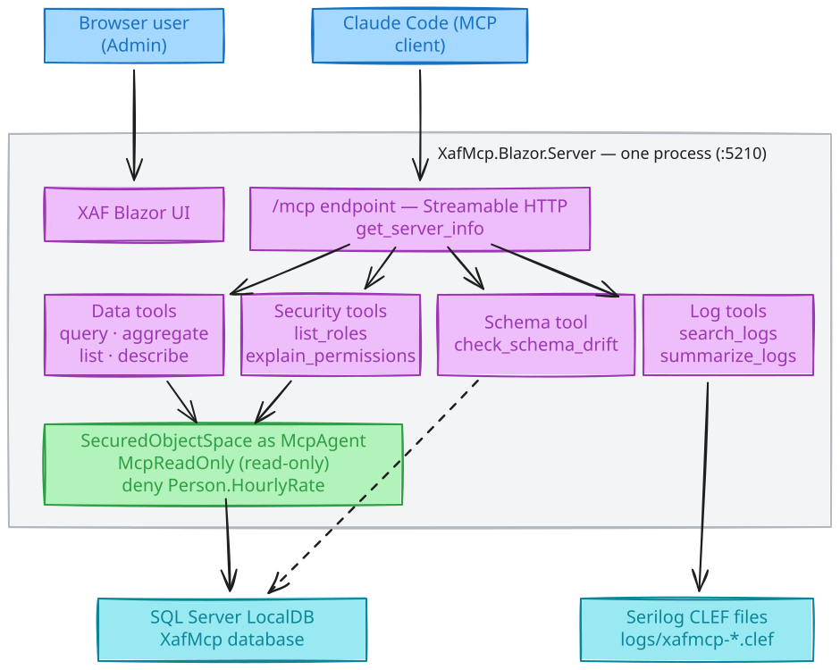

# XafMcp — an XAF LOB app as an MCP server

A DevExpress XAF Blazor Server application (Customers/Orders/Products/Projects/Tasks on LocalDB)
that embeds a Streamable-HTTP MCP endpoint in the same process, so an LLM client (Claude Code)
can interrogate the living application. Design: `docs/superpowers/specs/2026-08-09-xafmcp-design.md`.

## Architecture

Editable source: `docs/architecture.excalidraw`.

Want this in your own XAF app? Step-by-step guide with all the gotchas: `docs/how-to-implement.md`.

## Run

    dotnet run --project XafMcp.Blazor.Server -- --updateDatabase --forceUpdate --silent   # first time: create + seed DB
    ./scripts/run-app.ps1        # app + /mcp on http://localhost:5210 (stop: ./scripts/stop-app.ps1)

UI login: `Admin`, empty password. MCP data identity: `McpAgent` (read-only role, `Person.HourlyRate` denied).

## Connect Claude Code

    claude mcp add --transport http xafmcp http://localhost:5210/mcp

## Tools (all read-only)

get_server_info · list_entities · describe_entity · query_entities · aggregate_entities ·
list_roles · explain_permissions · check_schema_drift · search_logs · summarize_logs

Ad-hoc calls without an LLM: `./scripts/mcp-call.ps1 -Tool query_entities -ArgsJson '{"entity":"Order","top":5}'` (or `-List`).

## Acceptance script (ask Claude Code, app running)

1. "Using the xafmcp tools, write a short report on product opportunities per region."
   → uses describe/aggregate/query; the seeded bias (Software→North, Services growing in South) must show up.
2. "Give me a project status report — include overdue tasks."
3. "Any errors or warnings in the app logs?" → summarize_logs / search_logs.
4. Apply drift first: `sqlcmd -S "(localdb)\MSSQLLocalDB" -d XafMcp -i docs\drift-demo.sql`,
   then: "Is the database schema in sync with the application model?" → LegacyCode/LegacyImport findings.
5. "What is the MCP agent allowed to see and why?" → explain_permissions names the HourlyRate deny.
6. In none of the answers may a `HourlyRate` value appear.

## Reset the database

    ./scripts/stop-app.ps1
    sqlcmd -S "(localdb)\MSSQLLocalDB" -Q "ALTER DATABASE XafMcp SET SINGLE_USER WITH ROLLBACK IMMEDIATE; DROP DATABASE XafMcp"
    dotnet run --project XafMcp.Blazor.Server -- --updateDatabase --forceUpdate --silent

## Tests

    dotnet test XafMcp.Tests   # unit (pure logic; no app needed)
    dotnet test XafMcp.E2E     # login + MCP smoke (app must be running, else tests are Ignored)

Stack: .NET 10 · DevExpress XAF 26.1.4 (EF Core) · SQL Server LocalDB · ModelContextProtocol.AspNetCore · Serilog CLEF.
DevExpress license required. Private project.
